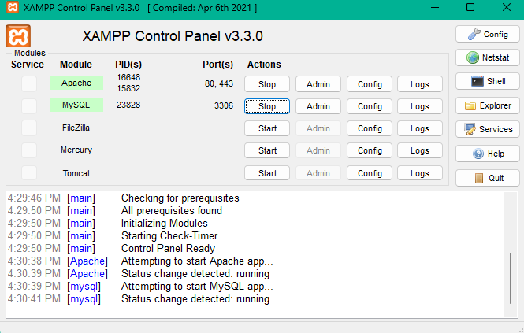
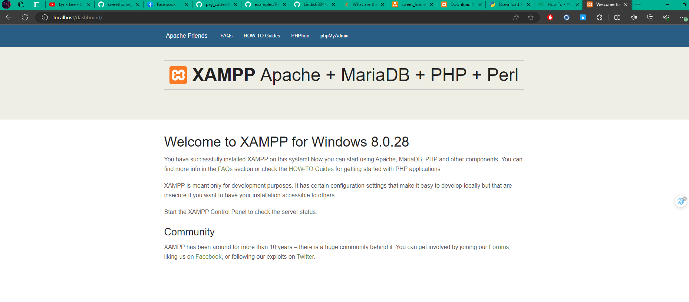
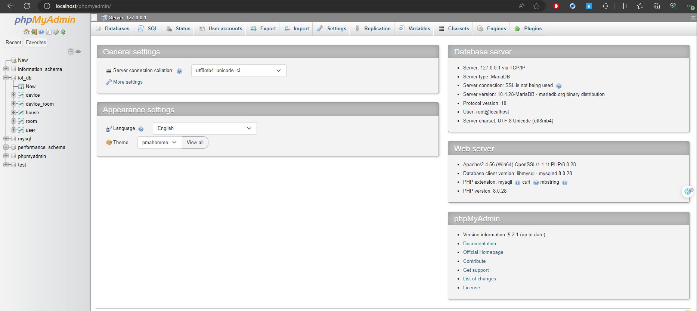
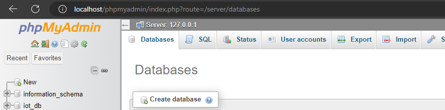
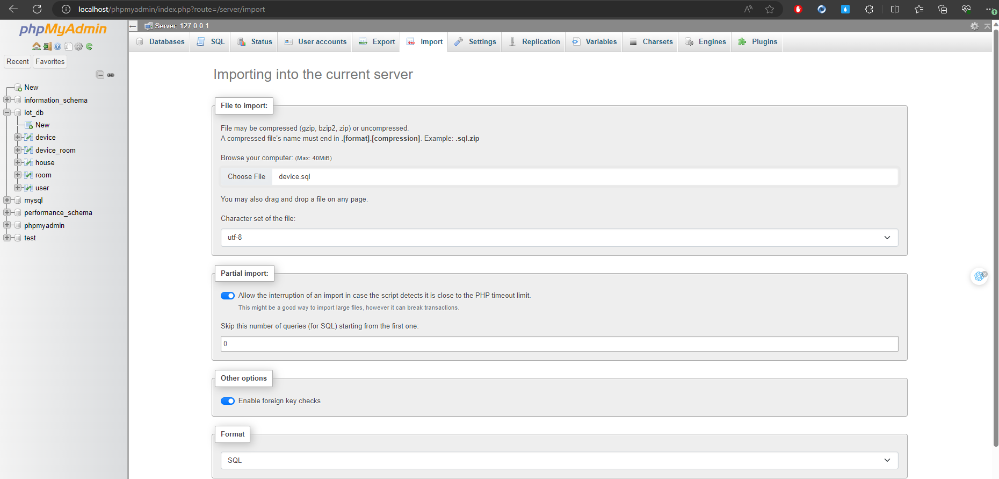
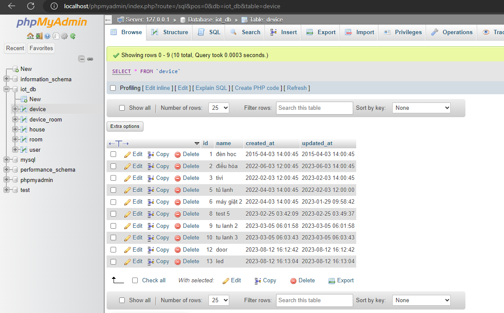
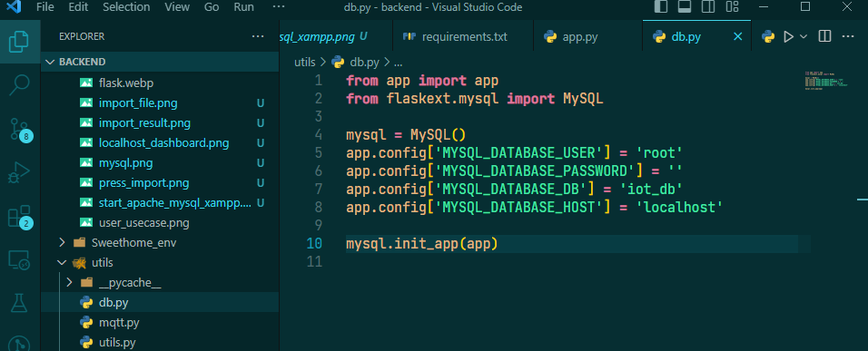
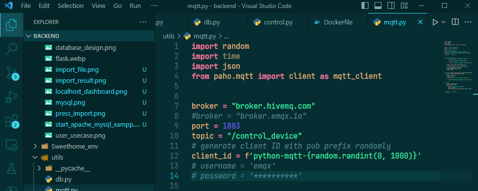
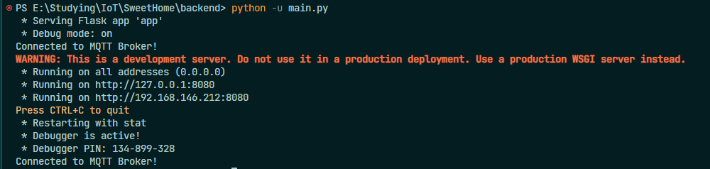

# Sweet Home

<div align="center">

<br/>
<br/>
</div>

## What is Sweet Home?

Sweet Home is a system that helps you to control devices of your smart homes.

## What is this repo?

This repo is backend of Sweet Home project. I use Flask - a framework of Python to make this project.

<div align="center">

</div>

## System Design

<br/>

- User usecases:
<br/>
<div align="center">

</div>
<br/>

- Admin usecases:
<br/>
<div align="center">

</div>
<br/>

- Database design:
<br/>
<div align="center">

</div>
<br/>

## Implementation

Ensure you have [Python](https://www.python.org/downloads/) (Python 3.10.11 recommended), [Xampp](https://www.apachefriends.org/download.html) (or other Relational Database Management Systems) in your computer and VSCode.

1. Clone or download project:

```bash
git clone https://github.com/Lindis0804/sweethome_backend
```

2. Install necessary packages:

```bash
pip install -r requirements.txt
```

3. Set up xampp:

- Open xampp, start apache and MySQL:
<br/>
  <div align="center">

</div>
<br/>

- Access http://localhost/dashboard/, press phpMyAdmin to access MySQL:
<br/>
  <div align="center">

</div>
<br/>
  <div align="center">

</div>
<br/>

- Create new database call iot_db and access it:
<br/>
  <div align="center">

</div>
<br/>

- Press import button and import 5 sql files of database/backup_data sequencely:
<br/>
  <div align="center">

</div>
<br/>

- Result:
<br/>
  <div align="center">

</div>
<br/>

4. Config database infor:

- You can change your mysql config in utils/db.py:
<br/>
  <div align="center">

</div>
<br/>

5. Config mqtt server infor:

- You can change your mqtt server infor (utils/mqtt.py) to connect to other mqtt but you can use default mqtt server info to connect to hivemq (a free mqtt server):
<br/>
  <div align="center">

</div>
<br/>

6. Run server:

- In this project, run command:

```bash
python -u main.py
```

- Result:
<br/>
  <div align="center">

</div>
<br/>
