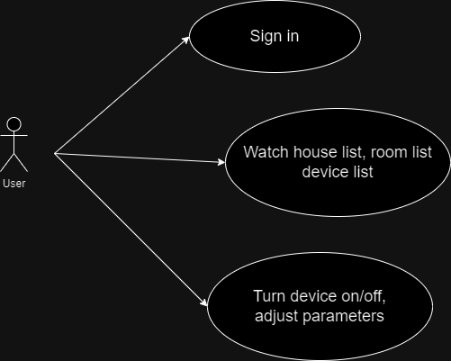
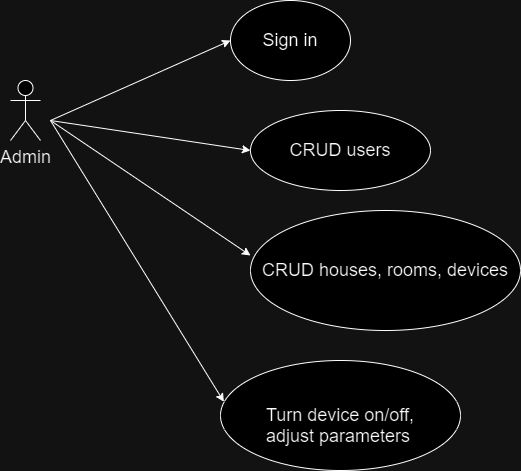
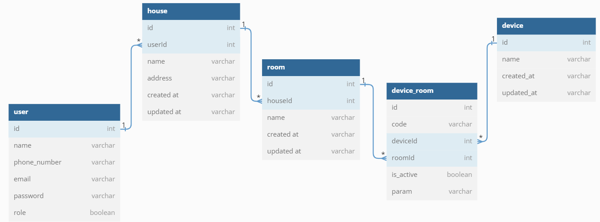

# Sweet Home

 
 

## What is Sweet Home?
Sweet Home is a system that helps you to control devices of your smart homes.
<h2>What is this repo?</h2>
This repo is backend of Sweet Home project. I use Flask - a framework of Python to make this project.

## System Design
 
* User usecases:

 
* Admin usecases:

 
* Database design:

 

## implementation
